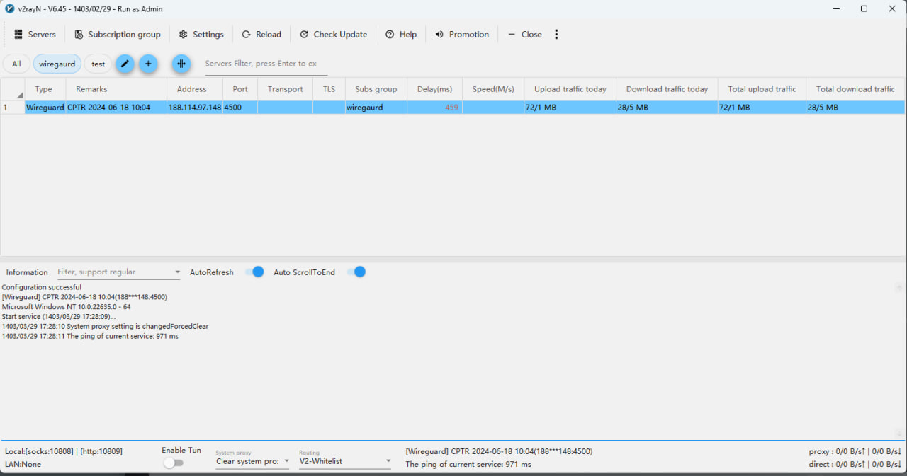

# V2RayN桌面软件，具有针对伊朗的最佳设置，带有Singbox Plus内核 和 Xray core


|Document language ：|Link|
----|----
|ایران|<a href="./README.md">مستندات فارسی</a>|
|English|<a href="./README_EN.md">English Document</a>|
|中文|<a href="./README_ZH.md">中文文档</a>|
|Türkiye|<a href="./README_TUR.md">Türkçe Dokümantasyon</a>|




### 在 Config 中所做的更改：

1- 将默认语言更改为英语

2- 将默认指纹和用户代理设置为Firefox

3- 默认启用 Fragment

4- 伊朗站点的路由设置

5-激活与系统兼容的主题并显示下载和上传速度

6- 添加子链接和五个 Warp 服务器

7-启动时最少的软件激活


### 如何使用
 - 首先，从以下链接下载并解压 V2RayN 的 32 位或 64 位版本之一：

```
https://github.com/2dust/v2rayN/releases
```

 - 然后下载guiNConfig.json和guiNDB.db文件，并将其复制到 v2rayN > guiConfigs 路径并运行软件。


### V2RayN 软件需要下载 X-ray 核心和 Singbox 才能运行，建议从以下链接下载相关文件并复制到 v2rayN > bin 路径：


- 从下面的链接下载 sing-box-plus 内核，并将其放在 sing_box 文件夹下的 bin 文件夹中。


```
https://github.com/kyochikuto/sing-box-plus/releases
```

- 我们将对 X 射线核心执行上述步骤。


```
https://github.com/GFW-knocker/Xray-core/releases
```


### 为了方便起见，我执行了这些步骤，并将现成的文件放在发布部分进行下载，您可以下载并使用它。


要更新以前的版本，只需下载update.zip文件并将其替换到以前的文件夹中即可。

**警告：如果您有子链接或个人配置，请务必备份 !!**


# 盼望自由 🕊️

### به یاد دوستای عزیزمون سگارو و یوسف 
### 为了纪念我们亲爱的朋友塞加罗和优素福

